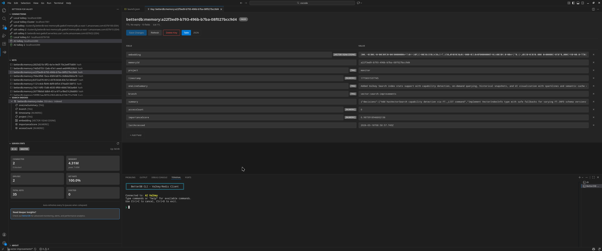
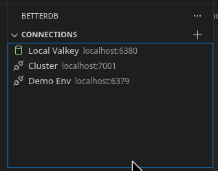
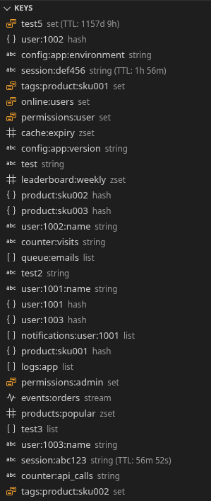
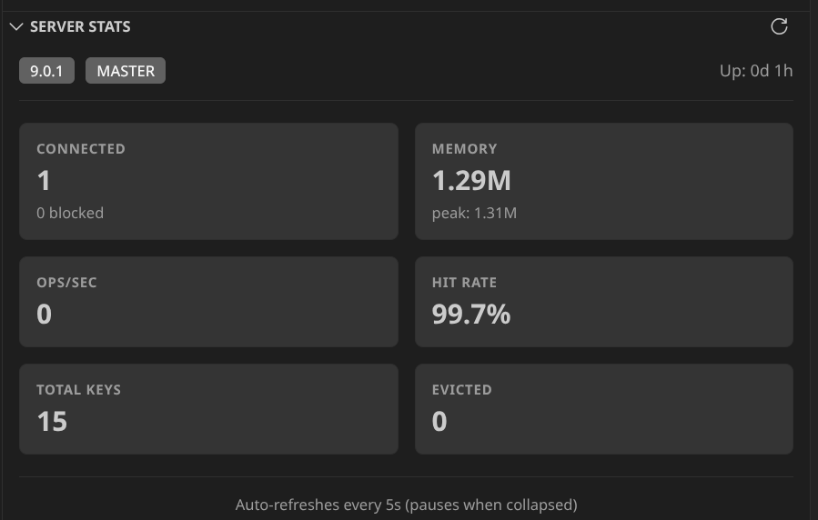
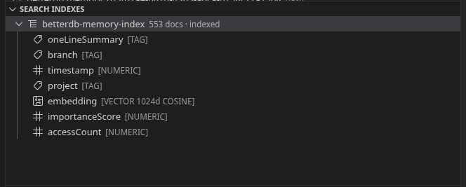
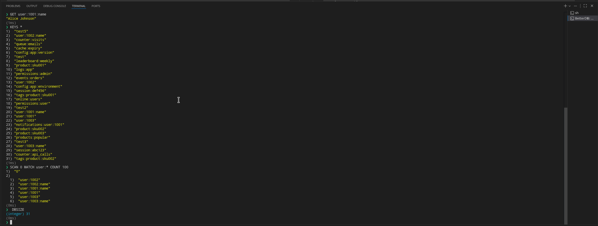
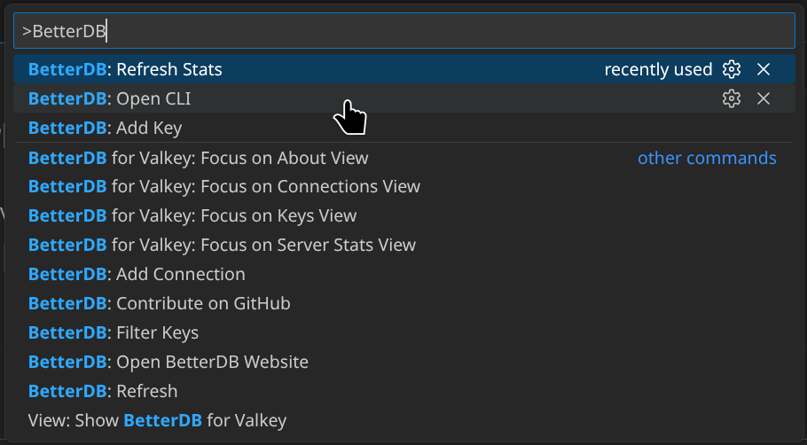

# BetterDB for Valkey

**Lightweight Valkey database management for VS Code**

Browse keys, edit values, and run commands without leaving your editor. Connect to remote databases via built-in SSH tunnel.

---

## Features

### Multi-Connection Management

Save and manage multiple Valkey/Redis connections. Credentials are stored securely using VS Code's SecretStorage API—never in plaintext config files.

### Key Browser

Scan and filter keys by pattern. See key types and TTL at a glance. Supports wildcard patterns like `user:*`, `session:*`, or `*:cache`.

### Full CRUD Support

View and edit Valkey data types with type-specific editors:

| Type | View | Edit | Delete |
|------|:----:|:----:|:------:|
| String | ✓ | ✓ | ✓ |
| Hash | ✓ | ✓ | ✓ |
| List | ✓ | ✓ | ✓ |
| Set | ✓ | ✓ | ✓ |
| Sorted Set | ✓ | ✓ | ✓ |
| Stream | ✓ | — | ✓ |

### Server Stats

Monitor your Valkey instance health at a glance. View real-time metrics including version, memory usage, connected clients, operations per second, hit rate, and more.

- Auto-refreshes every 5 seconds
- Pauses polling when collapsed to save resources
- Shows version, role, uptime, memory, ops/sec, hit rate, total keys, and evicted keys

### Search Index Browser

Browse Valkey Search (FT) indexes directly in the sidebar. See index schemas, field types, document counts, and indexing state at a glance. Hash key editors show inline field-type badges when a key belongs to an indexed prefix.

- Supports TEXT, TAG, NUMERIC, VECTOR, GEO, and GEOSHAPES field types
- VECTOR fields display dimension count and distance metric
- Automatically detects whether the Search module is available

### Integrated CLI

Execute commands directly with full output formatting. Command history persists across sessions.

- Syntax highlighting for responses
- Up/Down arrow for command history
- Ctrl+A/E/U/K/W editing shortcuts
- Tab completion (coming soon)

### Secure by Default

- Passwords stored in VS Code's SecretStorage
- TLS/SSL connection support
- No telemetry or data collection

---

## Quick Start

1. Install from the [VS Code Marketplace](https://marketplace.visualstudio.com/items?itemName=betterdb.betterdb-for-valkey)
2. Open the BetterDB panel in the Activity Bar (database icon)
3. Click **+** to add a connection
4. Enter your connection details and connect
5. Start browsing keys

### Alternative Installation (Cursor, VSCodium, etc.)

Download the `.vsix` file from [GitHub Releases](https://github.com/betterdb-inc/vscode/releases), then:

- **Cursor**: `code --install-extension betterdb-for-valkey.vsix`
- **VSCodium**: `codium --install-extension betterdb-for-valkey.vsix`
- **Or**: Open the editor → Extensions → `...` menu → "Install from VSIX..."

---

## Connection Settings

| Setting | Description | Default |
|---------|-------------|---------|
| Name | Display name for the connection | — |
| Host | Server hostname or IP | `localhost` |
| Port | Server port | `6379` |
| Username | ACL username (optional) | — |
| Password | Authentication password (optional) | — |
| Database | Database index | `0` |
| TLS | Enable TLS/SSL encryption | `false` |

### SSH Tunnel

Connect to remote Valkey/Redis instances through an SSH tunnel — no VS Code Remote-SSH or manual port forwarding required.

- Supports password and private key authentication
- Works with managed services like AWS ElastiCache and MemoryDB that are only accessible from within a VPC
- TLS connections work through the tunnel (SNI is forwarded automatically)
- Multiple simultaneous SSH tunnels supported
- Clear error messages when SSH auth fails, the tunnel times out, or the remote database is unreachable

When adding or editing a connection, choose **Yes** at the "Connect via SSH tunnel?" prompt and enter your SSH server details. The extension opens an SSH connection, creates a local TCP tunnel, and routes all Valkey traffic through it.

| Setting | Description | Default |
|---------|-------------|---------|
| SSH Enabled | Enable SSH tunnel for this connection | `false` |
| SSH Host | SSH server hostname or IP | — |
| SSH Port | SSH server port | `22` |
| SSH Username | SSH login username | — |
| SSH Auth Method | Password or Private Key | — |
| SSH Private Key | Path to private key file | — |

---

## Commands

Access commands via the Command Palette (`Ctrl+Shift+P` / `Cmd+Shift+P`):

| Command | Description |
|---------|-------------|
| `BetterDB: Add Connection` | Add a new database connection |
| `BetterDB: Add Key` | Create a new key |
| `BetterDB: Filter Keys` | Filter keys by pattern |
| `BetterDB: Open CLI` | Open the integrated CLI |
| `BetterDB: Refresh` | Refresh the key list |
| `BetterDB: Refresh Stats` | Refresh server stats |
| `BetterDB: Open BetterDB Website` | Visit betterdb.com |
| `BetterDB: Contribute on GitHub` | Open the GitHub repository |

Additional commands are available via context menus in the sidebar (Connect, Disconnect, Edit Connection, Delete Connection, Delete Key).

---

## Requirements

- VS Code 1.85.0 or higher
- Valkey 7.2+ or Redis 6.0+

Redis compatibility is maintained—BetterDB works with both Valkey and Redis servers. SSH tunneling is built in (ssh2 is bundled) — no additional software needed.

---

## Telemetry

This extension does not collect any telemetry or usage data.

---

## Development

Want to contribute or run locally? See [CONTRIBUTING.md](CONTRIBUTING.md) for setup instructions.

---

## Links

- [BetterDB Monitoring Platform](https://betterdb.com) — Full observability for Valkey
- [Report Issues](https://github.com/betterdb-inc/vscode/issues)
- [Valkey](https://valkey.io)

---

## License

MIT — See [LICENSE](LICENSE) for details.
