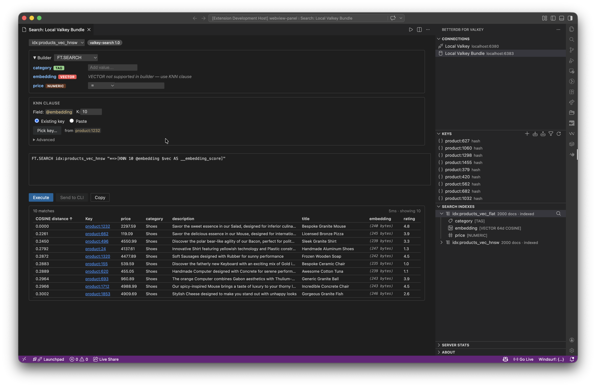

# Search Query Runner

Run `FT.SEARCH` queries against your Valkey Search / RediSearch indexes from a dedicated panel inside VS Code. Build filters visually, preview the raw command as you type, execute against the connected server, and jump from results straight into the key editor.

This page is a complete walkthrough. For a one-paragraph summary, see the [Search Query Runner](../README.md#search-query-runner) entry in the main README.



---

## Contents

- [Prerequisites](#prerequisites)
- [Opening the runner](#opening-the-runner)
- [The builder UI](#the-builder-ui)
- [Worked example: filter query](#worked-example-filter-query)
- [Vector KNN search](#vector-knn-search)
- [Results table](#results-table)
- [Copy command / Send to CLI](#copy-command--send-to-cli)
- [Capability matrix](#capability-matrix)
- [Troubleshooting](#troubleshooting)

---

## Prerequisites

- A connection to a Valkey or Redis server with a search module loaded:
  - [**valkey-search**](https://github.com/valkey-io/valkey-search) 1.0+ (supports TAG, NUMERIC, VECTOR)
  - [**RediSearch**](https://redis.io/docs/latest/develop/interact/search-and-query/) 2.x / 8.x (supports all field types including TEXT and GEO)
- At least one `FT.CREATE`-defined index. If you don't have one, the Search Indexes view in the sidebar will be empty and the query runner won't have anything to target.

BetterDB auto-detects which field types your server supports the first time you connect and hides builder controls that would fail at query time (see [Capability matrix](#capability-matrix)).

---

## Opening the runner

Three entry points — all open the same panel:

1. **Toolbar button** on the Search Indexes view — the magnifying-glass icon at the top-right of that view.
2. **Right-click** any index node in the Search Indexes tree → *Open Search Query Runner*.
3. **Command Palette** (`Cmd+Shift+P` / `Ctrl+Shift+P`) → **BetterDB: Open Search Query Runner**.

When opened from a specific index, the runner pre-selects that index. Otherwise the index dropdown is populated with every `FT._LIST` result for the active connection.

---

## The builder UI

The panel has four regions, top to bottom:

### 1. Header — index & command selector

- **Index** dropdown: every index known to the connected server.
- **Command** toggle: `FT.SEARCH` (the default; runs the builder query) or `FT.INFO` (inspects the index schema — ignores all filters below).

Switching the index resets field-filter rows and re-fetches the schema from `FT.INFO`.

### 2. Filter builder

One row per indexed field. Each row has an **Enabled** toggle (off by default), a field-name label with a type badge, and type-specific inputs:

| Field type | Inputs | Generated clause |
|-----------|--------|------------------|
| **TAG** | Multi-select picker (values auto-loaded from `FT.TAGVALS` when the server supports it) | `@field:{value1\|value2}` |
| **NUMERIC** | Operator (`=`, `>`, `>=`, `<`, `<=`, `between`) + one or two numbers | `@field:[10 20]`, `@field:[(5 +inf]`, etc. |
| **TEXT** | Free-text term; `*` suffix for prefix match, wrapping match with wildcards produces `'inner'` or `w'inner'` when a `WITHSUFFIXTRIE` flag is present | `@field:term`, `@field:"multi word"`, `@field:pre*` |
| **GEO** | Longitude, latitude, radius, unit (`m`/`km`/`mi`/`ft`) | `@field:[lon lat radius unit]` |
| **VECTOR** | Not a filter row — handled by the dedicated [KNN clause](#vector-knn-search) below |

Only **enabled rows with valid values** contribute to the generated query. Disable a row to temporarily park a filter without losing its inputs.

Multiple enabled clauses are joined with an implicit space (`AND` semantics in both engines). The whole filter body is then wrapped in double quotes when passed to the server, with inner quotes escaped.

### 3. Command preview

A read-only single-line box that shows the exact command the runner will execute. Updates live as you edit filters. Copy it verbatim into `valkey-cli` or any other client.

If the KNN clause is active, the preview shows the query body with the `$vec` placeholder; the actual binary bytes are passed out-of-band as a `PARAMS 2 vec <buf>` argument (never inlined as text).

### 4. Results region

Empty before the first run. After **Run**, shows total count + a scrollable table (see [Results table](#results-table)).

---

## Worked example: filter query

Assume you ran the BetterDB seed script (`~/Projects/betterdb-seed/seed.ts`) against a local server with valkey-search and created `idx:products` with schema `title TEXT description TEXT category TAG price NUMERIC rating NUMERIC`.

**Goal:** find products in the "electronics" or "books" categories priced between 10 and 50.

1. Open the runner (toolbar button on Search Indexes, or Command Palette).
2. Select **Index** → `idx:products`.
3. **Enable** the `category` row. In the tag picker, check `electronics` and `books`.
4. **Enable** the `price` row. Set operator to `between`, enter `10` and `50`.
5. Observe the command preview:

   ```
   FT.SEARCH idx:products "@category:{electronics|books} @price:[10 50]"
   ```

6. Click **Run**. The results table populates with matching hashes.
7. Click any row → the key editor opens with the hash fields already loaded.

If you instead want to inspect the index itself rather than query it, flip the command toggle to `FT.INFO` — the preview becomes `FT.INFO idx:products` and Run returns the full schema dump.

---

## Vector KNN search

If your server supports vector fields (valkey-search 1.0+, RediSearch 2.4+) and at least one indexed field has `VECTOR` type, the builder shows an additional **KNN clause** block between the filter rows and the command preview.

### KNN controls

| Control | Purpose |
|---------|---------|
| **Enable KNN** | Toggles the clause on. Off by default — filter-only queries remain the common case. |
| **Vector field** | Dropdown of every `VECTOR` field in the current index. |
| **K** | Number of nearest neighbors to return (1–1000). |
| **AS name** | The score alias — defaults to `__<field>_score`. Exposed in the results table as a sortable score column. |
| **EF_RUNTIME** | *(optional, HNSW only)* Runtime search depth. Leave blank for the index default. |
| **Vector input** | Multi-line text area. Accepts **two formats** — see below. |

### Vector input formats

The input area accepts either representation — the runner auto-detects by inspecting the first non-whitespace character:

**1. JSON array of floats**

```
[0.012, -0.441, 0.903, 0.124, 0.076, ...]
```

Use when you have a raw embedding from a model (most Python / JS vector libraries emit this shape). The array length must match the index's `DIM`; otherwise you'll see `expected 768 dims, got 384` inline.

**2. Base64-encoded FLOAT32 buffer**

```
AAABPgAAAT4AAAE+...
```

Use when you're pasting a pre-encoded embedding (e.g. from a URL parameter or an API response). The decoded byte length must equal `DIM × 4`; otherwise you'll see `expected 3072 bytes, got 1536`.

**Hex strings are not accepted.** If you have hex, convert it once in a shell:

```sh
# hex → base64 (macOS / Linux with xxd)
echo -n "<hex>" | xxd -r -p | base64
```

### Hybrid filter + KNN

When KNN is enabled and other filter rows are also enabled, the runner emits the hybrid syntax:

```
FT.SEARCH idx:products "(@category:{electronics})=>[KNN 10 @embedding $vec AS __embedding_score]" DIALECT 2 PARAMS 2 vec <bytes>
```

The parenthesized filter pre-selects candidates, then KNN ranks only those — much faster than ranking the full index, and required to mix semantic and structured constraints correctly.

If no filters are enabled, the pre-filter collapses to `*`:

```
FT.SEARCH idx:products "*=>[KNN 10 @embedding $vec AS __embedding_score]" DIALECT 2 PARAMS 2 vec <bytes>
```

The `DIALECT 2 PARAMS 2 vec <bytes>` suffix is always appended automatically for KNN queries — you never type it.

---

## Results table

After **Run** completes, the table shows one row per matching document. Columns:

- **Score** *(KNN only)* — the distance alias (`__<field>_score` by default). Sorted ascending (nearest first) client-side.
- **Key** — the matching document's full key. Clickable — opens the key editor.
- **One column per returned field**, in schema order.

Type-aware cell rendering:

- **TAG / NUMERIC / TEXT / GEO** fields render as plain strings.
- **VECTOR** fields render as `⟨N bytes⟩` in italic monospace — the raw bytes are **not** displayed (they would be UTF-8 garbage). This is a display choice only; click through to the key editor to inspect metadata or preserve the bytes on edit.
- **JSON documents** (from `ON JSON` indexes) render one column per returned JSON path.

### Clicking a result

Opens that key in the standard BetterDB key editor. For hashes containing vector fields (detected via the key's index schema), the vector field renders as a read-only `⟨N bytes · binary⟩` placeholder with the delete button disabled for that row. Editing and saving other fields preserves the vector bytes exactly — no corruption from UTF-8 round-tripping.

---

## Copy command / Send to CLI

Two toolbar buttons above the results table:

### Copy

Copies a ready-to-paste shell command to the clipboard. For non-vector queries, this is the literal `FT.SEARCH …` line. For KNN queries, it's a pipeline that streams the base64 vector into `valkey-cli -x`:

```sh
printf '%s' 'AAABPgAAAT4…' | base64 -d | \
  valkey-cli -h localhost -p 6379 -x \
  FT.SEARCH 'idx:products' '(@category:{electronics})=>[KNN 10 @embedding $vec AS __embedding_score]' DIALECT 2 PARAMS 2 vec
```

The `-x` flag tells `valkey-cli` to read the last argument from stdin, which is how we deliver the raw FLOAT32 bytes to the server.

### Send to CLI

Opens BetterDB's integrated CLI tab and pastes the same command — ready to run without touching an external terminal. For KNN queries this uses the same pipeline shape.

---

## Capability matrix

| Capability | valkey-search 1.0 | valkey-search 1.2+ | RediSearch 2.x / 8.x |
|-----------|:---:|:---:|:---:|
| TAG filters | ✓ | ✓ | ✓ |
| NUMERIC filters | ✓ | ✓ | ✓ |
| TEXT filters | — | ✓ (FTS) | ✓ |
| GEO filters | — | — | ✓ |
| VECTOR KNN | ✓ | ✓ | ✓ |
| `FT.TAGVALS` (tag autocomplete) | — | ? | ✓ |
| Hybrid filter + KNN | ✓ | ✓ | ✓ |
| Auto-detected engine label | yes | yes | yes |

When a capability is unavailable, the corresponding builder control is either hidden (e.g. no TEXT field shown on valkey-search 1.0 because no TEXT-indexed field can exist) or shown in a disabled state with a tooltip explaining the gap. Tag value autocomplete silently falls back to a free-text input when `FT.TAGVALS` isn't implemented.

The detected engine + version appears in the panel header ("valkey-search 1.0" or "RediSearch 2.10", etc.) so you can match behavior to the server at a glance.

---

## Troubleshooting

**The runner says "Search module not available"**
The connected server doesn't have a search module loaded. Install valkey-search or RediSearch and restart the server.

**The index dropdown is empty**
`FT._LIST` returned nothing. Create at least one index with `FT.CREATE` — or run the BetterDB [seed script](https://github.com/betterdb-inc/vscode) against a fresh server.

**"expected N dims, got M" when entering a vector**
The JSON array length doesn't match the index's `DIM`. Check the index schema (run `FT.INFO` on it) to confirm the expected dimension, and re-export the embedding from your model at the right size.

**Results are returned but the score column isn't sorted**
Should not happen — the runner sorts KNN hits client-side ascending by score. If you see an ordering bug, please [file an issue](https://github.com/betterdb-inc/vscode/issues) with the query, engine version, and a small reproduction.

**Editing a hash key wipes the vector**
Should not happen — vector fields are intercepted via an internal placeholder and the bytes are refetched via `HGET` (raw buffer read) on save. If you observe corruption after editing other fields, please [file an issue](https://github.com/betterdb-inc/vscode/issues) and include the index schema and the exact save sequence.

**A red banner appears saying `ERR unknown command 'FT.TAGVALS'`**
Should not happen on current builds — this error is now caught and falls back to a free-text tag input. If you still see the banner, update the extension.

**KNN results look semantically wrong (nothing is close to anything)**
The vector you submitted was probably produced by a different model / dimensionality / normalization scheme than the indexed vectors. KNN doesn't know — it just measures distance. Confirm the query embedding was produced by the same pipeline as the indexed embeddings (same model, same preprocessing, same normalization).

---

## See also

- [Main README → Search Query Runner](../README.md#search-query-runner)
- [Main README → Search Index Browser](../README.md#search-index-browser)
- [Valkey Search documentation](https://github.com/valkey-io/valkey-search)
- [RediSearch query syntax](https://redis.io/docs/latest/develop/interact/search-and-query/query/)
